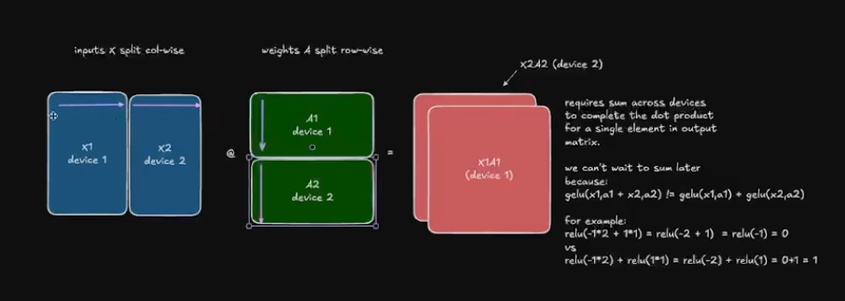
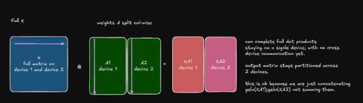
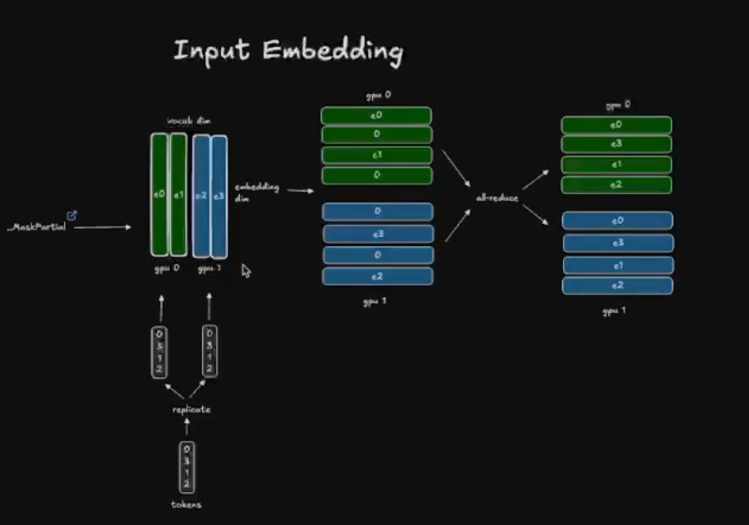

# parallelism techniques for llms

there are times where the llm doesnt fit in the gpu, or maybe you have multiple gpus that you want to make use of for fatser training etc. to scale the llm across multiple gpus, we use parallelism techniques.


## inter op vs intra op parallelism


inter-op parallelism:
– assign different operators to different devices. The second op depends on the output of the first op.
– typically requires point-to-point communication between consecutive
operators (like sending outputs from Device 1 to Device 2).
– potential device idle time when an operator finishes early and must
wait for other operators to complete their tasks before proceeding to
the next stage.

intra-op parallelism:
– splits a single operator across multiple devices (e.g., large matrix
multiplication).
– typically relies on collective communication (all-reduce, all-gather,
broadcast, etc.) to merge partial results.
– high throughput when well-implemented, but communication overhead can be significant if the operator is not large enough or if the
network is slow.


how to measure efficiency of parallelism?

we can arthimetic intensity which is ops/ data moved.
but this is relevant only for a single operator.

### MFU

intuitively, it is useful to understand how much percent of peak utilization of GPUs we are able to achieve. 

MFU = (FLOPs/t) / peak FLOPS

FLOPs - total float point ops
t - time taken to complete the op
peak FLOPS - max theoritical FLOPs the hardware can give.

some factors that can affect MFU -
- op Types in the Computational Graph: The type and shape of operations in the ML model can
affect MFU. For example, Different operations (e.g., matrix multiplication, convolution) have different
FLOPs which can affect MFU.
- Precision, Core, and GPU Type: The hardware’s precision (e.g., FP32, FP16), core count, and
GPU type (e.g., V100, A100, H100)influence peak FLOPs and thus MFU.
- Communication Over Network: Network communication can introduce delays, reducing MFU.
- Optimizations:Poorly optimized code or inefficient use of hardware resources can lower MFU. Techniques like precision reduction, core utilization,memory-efficient kernels, better scheduling and GPU
type selection can impact MFU.

MFU-Friendly and MFU-Unfriendly Operations
- MFU-friendly operations: Operations that maximize FLOPs utilization, such as matrix multiplications (matmul) with high arithmetic intensity.
- MFU-unfriendly operations: Operations that involve more data movement or memory-bound than
computation, such as element-wise operations (e.g., ReLU) or data shuffling.

## dp vs ddp

pytorch data parallelism (dp)

torch.nn.DataParallel is the earliest data parallelism method provided by PyTorch. it is implemented based on single process. it uses a single process to calculate model weights and distributes data to each GPU during each batch. the flow looks like this -
1. input are split from the main GPU to all GPUs.
2. the model is copied from the main GPU to all GPUs.
3. each GPU performs forward + backward pass, and compute gradients.
4. these gradients are sent to the main GPU, and the model weights are updated using the gradients.
5. the new weights are now copied from the main GPU to all GPUs
6. continue

yes, the single process design suffers from python GIL overhead, but the main issue is the master GPU becoming a bottleneck. all gradients need to be sent to the main GPU and aggregation happens only on this GPU, meanwhile the other GPUs are idle. this would result in really poort scaling as GPU count increases.


pytorch distributed data parallelism (ddp)

torch.nn.DistributedDataParallel is based on multiple processes and works more efficiently compared to the previous technique.
1. one process is launched per GPU.
2. during initialization, model parameters are synchronized so all replicas start identically.
3. each process receives a different shard of the dataset
4. each GPU performs forward + backward pass, and compute gradients.
5. instead of sending gradients to the main GPU alone, it does an all-reduce will all the other GPUs so now every GPU has the true reduced gradient.
6. each GPU now updates the weights using the same gradients, so the new model weights across all the processes are identical.
7. continue

this has no more bottleck of the master GPU and scales extremely well compared to dp.


## ddp vs fsdp (write notes for this)

## data parallelism

the idea is if you have 5 gpus -
1. you make copies of the llm in all 5 gpus.
2. you divide the data into micro batches and run them on the 5 gpus in parallel.
3. each gpu computes its own forward and backward pass independently.
4. now to get an updated final state of the llm, you do a nccl all-reduce operation on the gradients so now every gpu has the same averaged gradient, and each gpu updates its own weights identically.

a naive way is to wait for all the backward pass to finish and then reduce, but this makes the gpu idle and we dont want it.

we need to overlap compute and communication. there are 2 main techniques -


1. overlap the communication with backward pass - so the idea is as soon as the final layer backward pass is done, you can apply reduce on the gradient, while the earlier layers continue their backward pass. since backprop goes from last layer to first, you can pipeline this nicely
2. bucketing gradient - instead of running a communication for each step of the gradient, we can group them and then apply. this saves on communication cost.


data parallelism has its limits though. beyond a certain dp rank, throughput drops due to communication overhead scaling with the number of gpus. also, this whole approach assumes the model fits on a single gpu. if it doesn't, dp alone can't help you.

dp simply improves throughput by parallelizing many batches of data across gpus, the model itself isn't split at all.

## Zero Redundancy Optimizer (ZeRO)

the idea of zero is to shard the model parameters and gradients across the dp ranks, with each node only storing a slice of the items. These slices are then reconstructed when and if needed, thereby dividing memory usage by the data parallel degree Nd.

1. zero 1 - partition optimizer state

in the traditional dp, all the ranks gather the same gradients and perform identical optimizer step. this is a lot of duplicated work.

the core idea is instead of every gpu holding the full optimizer states, you partition them across the N gpus. so each gpu only holds 1/N of the optimizer states and only updates 1/N of the weights during the optimizer step.
but during the forward pass, every replica still needs the full set of parameters. so after the optimizer step, you need an all-gather to redistribute the updated weights back to all gpus.

sequence of operations for a single training step:

1. during the forward pass, each replica uses the full set of params, but runs on different micro-batches.
2. during backward pass, we use the full gradients computed locally per replica.
3. all reduce on the gradients, here each gpu ends up with only 1/N of the gradients. this replaces the all-reduce from vanilla dp.
4. each gpu runs the optimizer step on its local slice of optimizer states where it produces 1/N updated params.
5. then you do an all-gather on the params where every gpu gets the full set of updated weights back.

this way, you save tons of memory instead of holding optimizer full state , we hold only a portion of it.


2. zero 2 - partition the gradients now

in zero 1, since you only use a portion of the optimizer state, you only need a portion of the gradients, not the whole thing. 
so we dont do a all reduce, instead we do a scatter reduce on the gradients to get a portion of it. this is again extra memory savings since now we 
store only a portion of the gradients along with the optimizers.

3. zero 3 - parition the model layers as well

in zero 3, say you have 10 layers, for each forward and backward pass, you keep 1/N dp rank portion of the layer and at each step, you do an all gather
to get the entire layer, compute and then discard.

this sounds like a lot of communication overhead, but zero 3 uses overlapping where when layer N is being calculated, layer N + 1 is being prefetched, so the gpu is never idle.


despite having major savings by sharding optimizer, gradients and model parameters, you still cannot shard the activations. 

## memory usage in transformers

lets go back and see how activations impact the memory usage.

when you train an llm, you store several things in memory - 
- model weights
- model gradients
- optimizer states
- activations needed to compute the gradients

if N is the number of parameters and in fp32( 4 bytes) -
- memory for params = 4N
- memory for grad - 4N
- memory for optimizer state - (4 + 4)N

for the activation memory read here - https://huggingface.co/spaces/nanotron/ultrascale-playbook?section=memory_for_activations
but the general idea is that it grows out of control as you increase batch size and the sequence length.

and since the activations depend on the input, its hard to shard them using the data parallelism techniques we saw above.


## tensor parallelism

ref: https://huggingface.co/spaces/nanotron/ultrascale-playbook?section=tensor_parallelism_in_a_transformer_block

this technique shards weights, gradients, and optimizer states as well as activations.
the reason why this works is because of the math property of how you can use both row wise and column wise in matrix mul.

specifically, for a matrix multiply Y = XA, you can split A column-wise across gpus so each gpu computes a partial output slice, or split X row-wise and A row-wise so each gpu does a partial dot product and you sum at the end. this way you can shard both the linear and attention head either column or row wise.

the problem is you still need the entire activations for dropout, layernorm etc because you need the whole hidden dimension.

the standard way to do this is megatron-lm style where you alternate column and row parallel linear layers back to back so the all-gather from the column parallel output feeds directly into the row parallel input. this way you only need 2 communication ops per transformer block - one all-reduce after the row parallel linear and one after the mlp.

for attention specifically, each gpu gets a subset of heads. so if you have 32 heads across 4 gpus, each gpu handles 8 heads. this works cleanly because attention heads are independent of each other. for mlp blocks, column parallel splits the weight matrix vertically so each gpu computes a slice of the intermediate hidden dim. then row parallel splits horizontally and each gpu holds a slice of the input and does a partial matmul, then you all-reduce to sum the partial results.

the communication cost is the main tradeoff. every forward and backward pass requires all-reduce calls within the tensor parallel group. this means tensor parallelism is very sensitive to interconnect bandwidth. it basically only makes sense within a single node where you have nvlink, not across nodes over infiniband because the latency is too much. the other tradeoff is that increasing tensor parallel degree shrinks the per gpu compute chunk, so at some point the matmuls become too small to efficiently utilize the gpu and you lose more from underutilization than you gain from the memory savings.

## sequence parallelism TO-DO
## context parallelism TO-DO


## pipeline parallelism

pipeline parallelism is a more simpler technique, where you split the model layer's across multiple gpus. for example layer 1-5 in gpu1, layer 6-10 in another gpu etc. this saves a tons of memory since only a portion of the model is present on each gpu.

technique 1 - all forward all backward

there is a problem with naively spreading the layers across the gpu, the thing is when gpu 1 is computing layer 1-5, the gpus are waiting because they have the later layer which needs the activations of the prior layers. this seems sequential and too slow.

the fix for this is micro-batching. instead of sending one big batch through, you split it into smaller chunks. so while gpu 2 is processing micro-batch 1, gpu 1 can already start on micro-batch 2. this way gpus stay busier.

but now you have a different problem. you have to keep all the activations from every micro-batch in memory until the backward pass gets to them. with lots of micro-batches this causes a memory explosion because you're holding all those intermediate activations across all stages at once.

technique 2 - one forward, one backward

the core idea is simple, instead of doing all forwards then all backwards, you start the backward pass as soon as possible. here you alternate: one forward, one backward, one forward, one backward.

in the previous technique, you had to store activations for all m micro-batches at once. here you only need to store activations for pp micro-batches (the pipeline degree) because you're freeing them as soon as the backward pass catches up. this is a huge difference if you have 32 micro-batches but only 4 pipeline stages, and because memory is now cheaper, you can afford to use more micro-batches.

technique 3 - interleaving stages

the problem with the previous technique is that you cant keep stacking micro batches, because there is a limit to the global batch size.

the idea here is to stop slicing the model in big contiguous chunks and instead interleave which layers each gpu owns. instead of gpu 1 getting layers 1-4 and gpu 2 getting layers 5-8, you give gpu 1 layers 1,3,5,7 and gpu 2 layers 2,4,6,8. each gpu now owns multiple non-contiguous chunks of the model instead of one big block. this creates a looping pipeline where a micro-batch has to travel through all gpus multiple times to complete its forward pass, once per chunk. it's more round trips but each individual pass is shorter and you can interleave them much more tightly.

the cost is communication scales up by the number of chunks you split the model into. every extra chunk means another boundary crossing, so the micro-batch hits the network N times as much as before.


1. megatron v1(distributed training)
(references - https://www.youtube.com/watch?v=ImKyR1tsPPE)

the main crux of the paper is to use model parallelism with a few synchronize primitives.

- mlp block
 this consists of a GEMM + GELu(some activation)

one option to parallelize the GEMM is to split the weight matrix A along its rows and input X along its columns(bad option)




better to split along the columns, so gelu can be applied independently



by doing this split, we dont have to apply , the all-reduce immediately.


now for the second GEMM, we split along rows, do an all-reduce and then do dropout.


- attention block
the idea is each of the self attention head doesnot depend on each each, so we split then across GPUs


- embedding layer

imagine we have vocab size 50k, parallelizing them across gpus is more beneficial. but this is a bit more trickier since if we break the embedding layer, we wont have all the indexes in one gpus, how do we handle this?



if the index is present, then retrieve it, else zero. finally in all reduce we get all the values. although we use a all-reduce primitive.

- final output layer


## torch titan

torch titan starts with a one-dimensional device mesh containing every gpu:

```text
world = [gpu0, gpu1, gpu2, gpu3]  # shape: (4,)
```

it then unflattens this physical mesh into different logical views. each view contains
the same gpus, but its named dimensions group them differently for each parallelism
strategy.

### parallelism dimensions

| dimension | meaning |
| --- | --- |
| `pp` | pipeline parallelism: partitions model layers into stages and places each stage on a different gpu group. |
| `dp_replicate` | replicated data parallelism: keeps a full model replica in each group, processes a different micro-batch on every replica, and synchronizes gradients as in ddp. |
| `dp_shard` | sharded data parallelism: shards parameters, gradients, and optimizer states across the group as in fsdp. parameters are all-gathered when needed, and gradients are reduce-scattered. |
| `cp` | context parallelism: splits the sequence dimension across gpus so that each gpu processes only part of the input tokens. |
| `tp` | tensor parallelism: splits dense tensor operations, such as attention and mlp matrix multiplications, across gpus. |
| `ep` | expert parallelism: distributes different moe experts across gpus. |
| `etp` | expert tensor parallelism: applies tensor parallelism inside each expert. this is a useful general concept, but current torch titan `main` does not expose it as a separate mesh axis. |

`dp_replicate` uses more memory because every replica holds the full model, but it
avoids gathering parameters before each computation. `dp_shard` reduces memory usage,
but introduces communication to gather parameters and distribute gradients.

### derived dimensions

the multiplication signs are easier to understand if the gpus are viewed as coordinates
in a grid. for example, `dp_shard = 2` and `cp = 4` create this grid:

```text
                 cp0   cp1   cp2   cp3
dp_shard0         g0    g1    g2    g3
dp_shard1         g4    g5    g6    g7
```

the grid has `2 * 4 = 8` unique coordinates, so it requires eight gpus. multiplying
degrees does not mean that one parallelism algorithm turns into another. it means that
the parallelisms use independent axes of the same device grid.

torch titan also *flattens* some axes. flattening means treating every gpu that differs
along either axis as one larger communication group:

```text
batch = dp_replicate * dp_shard
fsdp  = dp_shard * cp
efsdp = (fsdp * tp) // ep
```

#### why `batch = dp_replicate * dp_shard`

both axes create independent data replicas:

- `dp_replicate` changes which full or hybrid-sharded model replica a rank belongs to.
- `dp_shard` changes which parameter shard a rank owns, but each rank still receives a
  different local batch.

therefore, the dataloader sees their product as the total number of different data
shards. for example, `dp_replicate = 2` and `dp_shard = 4` produce eight data-parallel
workers.

#### why `fsdp = dp_shard * cp`

`dp_shard` and `cp` are still different concepts:

- `dp_shard` partitions model states.
- `cp` partitions tokens in a sequence.

torch titan flattens them into one fsdp communication group for dense parameters. cp
ranks process different token shards, so their parameter gradients must also be
combined. torch titan makes those ranks participate in fsdp's parameter all-gather and
gradient reduce-scatter. consequently, an operation on the flattened `fsdp` axis spans
all `dp_shard * cp` ranks.

for example, with `dp_shard = 2` and `cp = 4`, each dense parameter is fsdp-sharded
across an eight-rank group. this does **not** mean cp has become fsdp; it means the cp
ranks are also members of the parameter-sharding group.

#### why `efsdp = (fsdp * tp) // ep`

dense and moe layers interpret the same gpu pool differently:

```text
dense layer pool:  fsdp * tp
moe layer pool:    efsdp * ep

therefore:
efsdp * ep = fsdp * tp
efsdp      = (fsdp * tp) // ep
```

for dense layers, part of the pool shards parameters with fsdp and part shards matrix
operations with tp. for moe layers, torch titan reuses that pool to distribute experts
with ep; any ranks left after forming the ep groups become the expert-parameter fsdp
degree.

example:

```text
fsdp = 4
tp = 2
ep = 4

dense pool = 4 * 2 = 8 gpus
efsdp = 8 // 4 = 2
moe pool = efsdp * ep = 2 * 4 = 8 gpus
```

the dense layers use an `fsdp=4, tp=2` view, while moe layers use an
`efsdp=2, ep=4` view of the same eight gpus.

in systems that expose a separate expert tensor-parallel degree, the generalized
relationship is:

```text
efsdp * ep * etp = fsdp * tp
efsdp = (fsdp * tp) // (ep * etp)
```

here, `ep` assigns different experts to ranks, while `etp` splits the matrices *inside*
each expert. current torch titan `main` has no separate `etp` mesh axis, so its actual
formula uses only `ep`.

### logical mesh views

the one-dimensional world mesh is reshaped into three views:

| mesh | dimensions | purpose |
| --- | --- | --- |
| `dataloading_mesh` | `(pp, batch, cp, tp)` | determines which data shard each rank reads; torch titan separately flattens `batch` and `cp` into a loss-reduction mesh. |
| `dense_mesh` | `(pp, dp_replicate, fsdp, tp)` | applies fsdp and tensor parallelism to non-moe layers. |
| `sparse_mesh` | `(pp, dp_replicate, efsdp, ep)` | applies fsdp and expert parallelism to moe layers. |

for example, with four gpus and the following configuration:

```text
pp = 1
dp_replicate = 1
dp_shard = 4
cp = 1
tp = 1
ep = 4
```

the derived dimensions and mesh shapes are:

```text
batch = 1 * 4 = 4
fsdp  = 4 * 1 = 4
efsdp = (4 * 1) // 4 = 1

dataloading_mesh = (1, 4, 1, 1)
dense_mesh       = (1, 1, 4, 1)
sparse_mesh      = (1, 1, 1, 4)
```

each shape multiplies to `4`, so every view contains all four gpus.

### mesh-size constraint

every logical mesh must contain exactly `world_size` devices:

```text
world_size = pp * batch * cp * tp
           = pp * dp_replicate * fsdp * tp
           = pp * dp_replicate * efsdp * ep
```

after substituting the derived dimensions, all three expressions reduce to:

```text
world_size = pp * dp_replicate * dp_shard * cp * tp
```

the expert dimensions must divide the available group exactly:

```text
(dp_shard * cp * tp) % ep == 0
```

checking only that `dp_shard * cp * tp >= ep` is not enough. without exact
divisibility, integer division would truncate `efsdp`, and the sparse mesh would no
longer contain `world_size` devices.

### rules for combining parallelisms

start with the physical gpu budget:

```text
world_size = pp * dp_replicate * dp_shard * cp * tp
```

every configured degree must be a positive integer, and their product must equal the
number of gpus. current torch titan can infer `dp_shard` from the remaining gpu budget:

```text
dp_shard = world_size // (pp * dp_replicate * cp * tp)
```

the division must be exact. after choosing the dense-layer dimensions, moe expert
parallelism must also fit the same per-pipeline-stage pool:

```text
(dp_shard * cp * tp) % ep == 0
number_of_experts % ep == 0
```

the second rule is the usual balanced placement requirement: every ep rank should own
the same number of experts.

other model-shape constraints normally include:

| combination | important constraint |
| --- | --- |
| `tp` | attention heads, hidden dimensions, and relevant mlp dimensions must be divisible by `tp`, according to the model's tp plan. |
| `cp` | sequence length must be divisible by the cp partitioning scheme. torch titan's default load-balanced cp path requires divisibility by `2 * cp`. |
| `tp + cp` | torch titan's sequence-parallel path makes sequence length divisibility depend on both axes; its current helper uses `tp * 2 * cp`. |
| `pp` | model layers must be assignable to pipeline stages, and the micro-batch schedule needs enough micro-batches to keep stages busy. |
| `ep` | the model must be moe, experts should divide evenly across ep ranks, and ep must divide `dp_shard * cp * tp`. |
| `ep + etp` | in frameworks with etp, `ep * etp` must divide the expert gpu pool; the expert hidden dimensions must also be divisible by `etp`. |

### how to choose a combination

choose dimensions based on the bottleneck, then give the remaining gpus to data
parallelism:

1. use `tp` when a layer or its activations do not fit on one gpu. keep tp groups on
   fast links when possible because tensor collectives occur inside each layer.
2. use `cp` when long-sequence activations, especially attention, are the memory
   bottleneck.
3. use `pp` when the full stack of layers still does not fit, or when scaling across
   multiple nodes makes a pipeline layout useful.
4. for moe models, use `ep` to distribute experts. use `etp` only when the framework
   supports it and one expert is itself too large for one gpu.
5. use the remaining gpu factor for `dp_shard`; add `dp_replicate` when memory permits
   and another replica gives better throughput.

for example, on 64 gpus:

```text
pp = 2
tp = 4
cp = 2
dp_replicate = 1
dp_shard = 4

2 * 4 * 2 * 1 * 4 = 64
```

for an moe model with `ep = 8`:

```text
fsdp = dp_shard * cp = 4 * 2 = 8
dense pool = fsdp * tp = 8 * 4 = 32
efsdp = dense pool // ep = 32 // 8 = 4
```

inside each pipeline stage, dense layers see `(fsdp=8, tp=4)`, while moe layers see
`(efsdp=4, ep=8)`. both views use the same 32-gpu pool.
